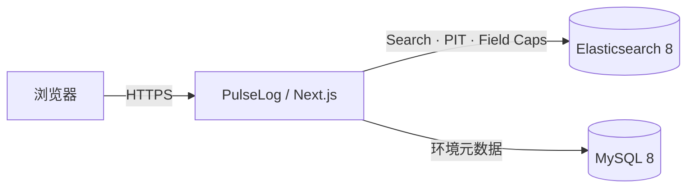

# PulseLog

PulseLog 是面向 Elasticsearch 8 服务日志场景的轻量级 Discover 工作台。它在一个 Next.js 部署单元内同时提供现代化 Web UI 和安全的 Elasticsearch 查询代理，不要求 Kibana，也不要求 ES 超级管理员权限。

## 已实现功能

- Discover 风格日志列表、字段栏、文档详情抽屉与日志量时间直方图
- 深色/浅色主题切换并记忆用户选择
- 在日志趋势图上拖动选择精确时间区间并自动重新查询
- 日志 message 支持行内单条展开、全部展开和全部收起，完整 `_source` 仍可从展开区查看
- 最近 15/30 分钟、1/4/12/24 小时、3/7/30 天快捷时间范围
- 简化查询语言：等值、文本分词、短语、`AND`、`OR`、括号和隐式 `AND`
- 查询框按当前光标位置提示字段、字段类型、可用条件和 `AND/OR`，支持方向键、Tab、Enter 与 Esc 操作
- 感知 ES 映射：`text` 使用 `match` / `match_phrase`，`keyword` 使用 `term`，`wildcard` 使用 `wildcard`
- `message.pattern:*foo*` 会生成大小写不敏感的 contains wildcard 查询
- 通过 `_field_caps` 自动加载可搜索字段和字段类型
- 字段侧栏支持一键复制字段名；展开后可查看当前已加载 500/1000 条日志中的值分布和占比，高基数字段自动降级为样例展示，并可通过值右侧的加号追加筛选
- 日志详情中的 object、nested 和数组值以可折叠、类型着色的 JSON 树展示
- 字段存在性查询支持 `field:EXISTS`、Kibana 风格 `field:*` 和 Lucene 风格 `_exists_:field`
- PIT + `search_after` 深度分页，不受 `index.max_result_window=10000` 限制
- 多环境配置与顶部快捷切换；支持 Basic Auth、API Key、CA 证书和带认证的 HTTP(S) 代理
- ES 密钥仅保存在服务端，MySQL 中使用 AES-256-GCM 加密
- 环境变量零数据库启动，以及 MySQL 多环境持久化两种模式
- 登录保护、HttpOnly 会话 Cookie、安全响应头、输入校验和安全错误输出
- 单容器镜像与 Docker Compose 示例

## 查询语法

| 示例 | 字段映射 | Elasticsearch 查询 |
| --- | --- | --- |
| `service:payment` | `keyword` | `term` |
| `status:500` | `integer` | 数值 `term` |
| `message:timeout` | `text` | `match`，词间为 AND |
| `message:"connection refused"` | `text` | `match_phrase` |
| `message.pattern:*foo*` | `wildcard` | `wildcard` + `case_insensitive` |
| `trace.id:EXISTS` / `trace.id:*` | 任意 | `exists` |
| `service:api AND level:ERROR` | 任意 | `bool.must` |
| `level:WARN OR level:ERROR` | 任意 | `bool.should` |
| `service:api message:timeout` | 任意 | 隐式 `AND` |

为避免 text 字段上的高成本误用，`message:*foo*` 会被拒绝。请查询对应的 `wildcard` 或 `keyword` 字段，例如 `message.pattern:*foo*`。

## 最小 Elasticsearch 权限

PulseLog 不会创建或修改索引、模板、数据流、ILM 策略或集群配置。建议单独创建只读角色：

```json
{
  "indices": [
    {
      "names": ["logs-*"],
      "privileges": ["read", "view_index_metadata"]
    }
  ]
}
```

其中 `read` 用于 Search/PIT，`view_index_metadata` 用于 Field Capabilities。若管理员不允许后者，未来可以把字段映射改为显式配置；当前版本依赖它来正确区分 `text`、`keyword` 和 `wildcard`。

## 快速启动

要求 Node.js 24+，MySQL 是可选项。

### 无 Elasticsearch 的界面调试

无需创建 `.env`，执行下面的命令即可启动完整的 Mock 演示环境：

```bash
npm ci
npm run dev:mock
```

打开 `http://localhost:3000` 后会自动进入首页，无需登录。Mock 模式提供 1500 条动态日志样本以及 keyword、text、wildcard、boolean、number、object 和数组字段，支持实际体验字段/条件提示、`AND/OR`、`EXISTS`、通配符、时间过滤、趋势图、分页、枚举值筛选和 JSON 树。

Mock 模式仅在 `next dev` 的开发环境中生效，页面右上角会显示 `MOCK DATA`，不会在生产构建或 `next start` 中绕过登录、访问真实 ES 或写入环境配置。

### 连接 Elasticsearch

```bash
cp .env.example .env
# 编辑 .env，至少配置 APP_PASSWORD、ENCRYPTION_KEY 和 ES_URL
npm ci
npm run dev
```

打开 `http://localhost:3000`。

### 单容器、无 MySQL

只配置 `.env.example` 中的 `ES_*` 变量，不设置 `DATABASE_URL`。此时环境来自容器环境变量，UI 中可查询和切换，但新增环境需要 MySQL。

```bash
docker build -t pulselog:0.1.0 .
docker run --rm -p 3000:3000 --env-file .env pulselog:0.1.0
```

### Compose（应用 + MySQL）

```bash
cp .env.example .env
# 填写所有口令和 ES 连接信息
docker compose up -d --build
curl http://localhost:3000/api/health
```

应用启动后会执行幂等的 `CREATE TABLE IF NOT EXISTS`。生产环境若应用账号没有 DDL 权限，请由 DBA 先执行 [`docs/mysql-schema.sql`](docs/mysql-schema.sql)，随后仅授予该表的 `SELECT/INSERT/UPDATE/DELETE`。

## 生产部署建议

1. 使用 `openssl rand -hex 32` 生成 `ENCRYPTION_KEY`，不要轮换它而不迁移已有密文。
2. 通过 Kubernetes Secret、Docker Secret 或企业密钥系统注入敏感环境变量，不要提交 `.env`。
3. 保持 `ES_TLS_VERIFY=true`；自签名证书通过 `ES_CA_CERT` 或环境配置页录入 CA。
4. 在入口网关启用 HTTPS，并根据组织要求叠加 SSO/WAF。内置密码登录适合小团队独立部署。
5. 对 PulseLog 使用的 MySQL 账号最小授权，对 ES 账号只授权目标日志索引。
6. 多副本部署可以直接共享 MySQL；会话是无状态签名 Cookie，不要求 sticky session。

通过环境变量启动时，可使用 `ES_PROXY_URL` 配置 HTTP(S) 代理，并按需设置 `ES_PROXY_USERNAME` 和 `ES_PROXY_PASSWORD`。代理密码与页面中录入的 ES 密钥一样不会返回浏览器，MySQL 模式下使用 AES-256-GCM 加密保存。

已有 MySQL 表会在应用首次启动时自动增加代理字段。如果生产环境中的应用账号没有 DDL 权限，请先由 DBA 执行：

```sql
ALTER TABLE environments
  ADD COLUMN proxy_url VARCHAR(2048) NULL AFTER ca_cert_encrypted,
  ADD COLUMN proxy_username VARCHAR(255) NULL AFTER proxy_url,
  ADD COLUMN proxy_password_encrypted TEXT NULL AFTER proxy_username;
```

## 架构



浏览器永远不会直连 Elasticsearch。查询字符串先在服务端解析成受控 AST，再按字段类型编译为 Elasticsearch Query DSL；客户端无法提交任意 DSL。

## 验证

```bash
npm test
npm run lint
npm run build
```

当前单元测试覆盖 wildcard、短语、等值、数值、AND/OR 优先级、隐式 AND 与非法查询。建议上线前再使用实际 ES8 集群做最小权限集成测试。
